### Hi there 👋 To write code, for me, is:
To translate — but in a different way. Doing some magic! 🪄\
Always looking on the bright side of life, or a user's screen — and at the dark-mode page of code, too. \
I love this way of thinking both of the scrutiny of details and of the bigger picture traversing layer after layer of a full code stack.

- ✨ From visuals from my head into text into visuals at a coworker's head.
- ✨ From text or code into visuals in my head into fixing bugs. 💡
- ✨ From code into life — that of a user seeing how their life can improve.
- ✨ Thereby, I have become somebody new as well. ✨

People also know me as 📙 [**The Fluttering Dev that can C#**](https://danielagrothe.substack.com/) on Substack.

### The boring stuff: How to reach me etc.
I'm from Germany. I am currently...
- 🔎 for a job position as a .NET dev
- 👩‍🏫 Part-time private-lessons teacher for 📐Math, English, Python and French
- 🔧 Contributing to nice projects
- 📫 How to reach me: [LinkedIn](https://www.linkedin.com/in/daniela-grothe-743ab8235/) ~~~ [💰☕Ko-fi](https://ko-fi.com/danielagrothe)

### Projects
- 👩‍💻 Helping visually impaired with reading texts
  - Train ticket summary [ZugFahrtPlaner](https://github.com/DGrothe-PhD/ZugFahrtPlaner)
  - VideoText 👉 [PyTellMe](https://github.com/DGrothe-PhD/PyTellMe)
- Learning Flutter through making of [punktspiel App](https://github.com/DGrothe-PhD/punktspiel/)
- 🔭 🧩 [Mastermind](https://github.com/DGrothe-PhD/Mastermind) and 📕 [NachhilfeDB](https://github.com/DGrothe-PhD/NachhilfeDB)
- 👩‍💻 Other repos of mine 📝 [JavaWordChecker](https://github.com/DGrothe-PhD/WordCheckerJava) and 🐍 [Python Wordchecker](https://github.com/DGrothe-PhD/Wordchecker)

### More to find …
[Github Page](https://dgrothe-phd.github.io/DGrothe-PhD/)

***

<!--
- 👯 I’m looking to collaborate on ...
- 🤔 I’m looking for help with ...
- -->

 

also: Mathematica, LabView, Maple; SVN, TortoiseGit, &hellip;

<picture>
  <source
    srcset="profile/stats-dark.svg"
    media="(prefers-color-scheme: dark)">
  
</picture>

<!---->
<!---->

### Offline projects including:
- Painting, cycling, &hellip;
- Years ago:
  - Getting e-mails out of a client that's been out of support
  - Soccer points calculation with Excel (that was before getting to know SQL)
- Reading books off-line

***
### My 🌟 go to... 
- Good old *GIMP*, *InkScape*, *Notepad++* and *LaTeX* using for (p)ages&hellip;
  - **Visual Studio Code**: <a href="https://github.com/TeamMeow/vscode-math-to-image">VSCode Math to Image</a>
  - **VS 2022**: <a href="https://github.com/dotnet/ResXResourceManager">ResXResourceManager</a>
- Desktop:
  - <a href="https://github.com/iXab3r/MicSwitch">MicSwitch</a> and 
  - <a href="https://keyboard-leds.com/">KeyboardLEDs</a>
- Apps:
  - https://github.com/kreativzirkel/coronika
